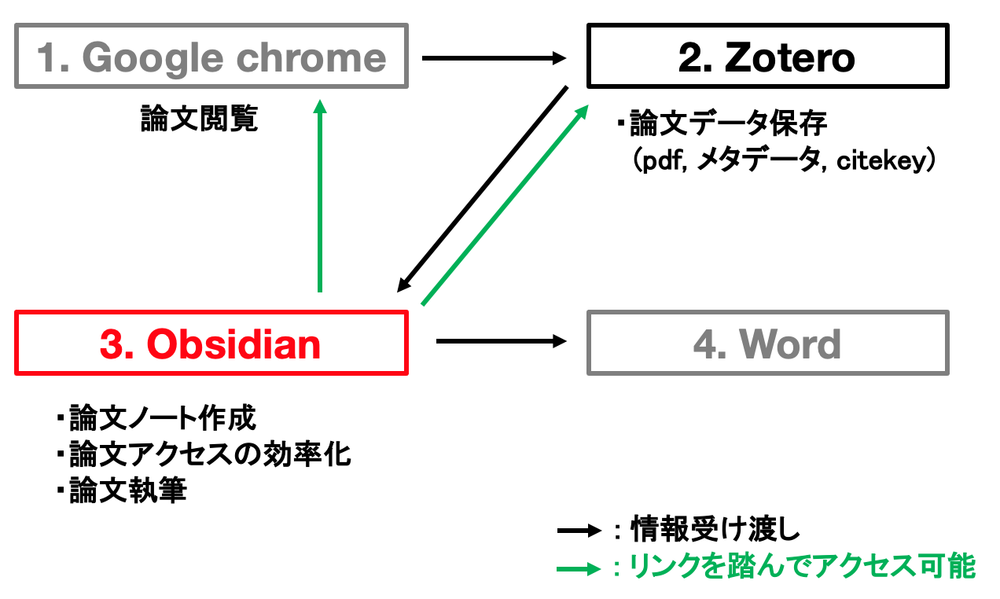
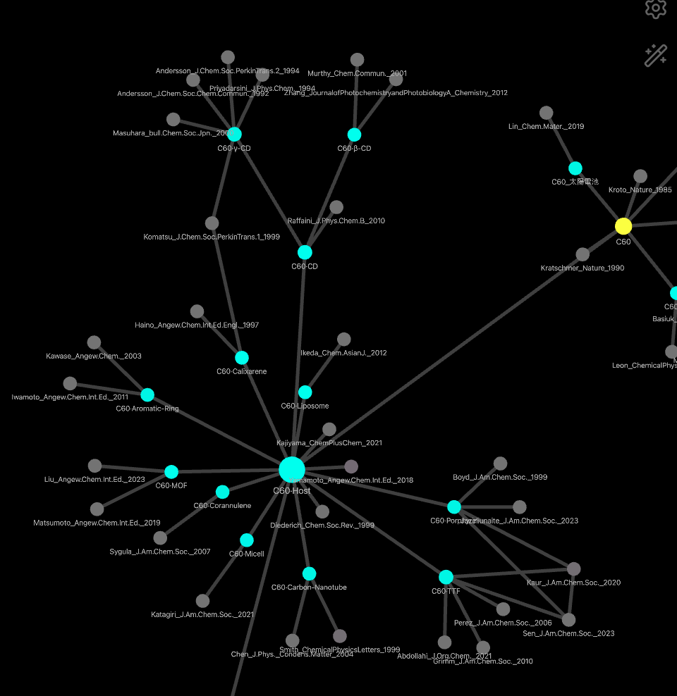

# Zotero+Obsidianによる論文管理・執筆システムの確立 マニュアル

## 本システムの概説

### システムの概観

Obsidianが論文ノートの作成・論文アクセスの効率化・論文執筆を一挙に担い、これらを大幅に効率化する。

### 本システムが解決するもの

本システムの導入により、zoteroでの論文探し、アノテーション+ノート作成、wordでのzoteroウィザードを用いた論文作成は不要となり、
Zotero + Word システムにおける、下記問題が解決される。  
・論文のフォルダ管理が面倒である。  
・保存した論文を探すのが面倒である。メタデータやフォルダを覚えておかないといけない。  
　(脳容量を圧迫する)  
・word自体の動作が重い。(スクロールが勝手に戻ってしまう。)  
・引用を付ける際に、毎回zoteroウィザードを出して、論文を探さないといけない。ウィザードの動作が遅い。

### 本システムの利点

・フォルダ形式および階層管理に縛られない、接続を基調とした比較的自由な体制での論文および概念の管理が可能となる。  
・論文ノート(+ポータルページ)におけるリンク設定により、関連論文や上下概念への遷移が容易。  
　dataviewにより、論文を表形式で自動的にまとめ、様々な観点からアクセス可能とする。
 グラフィカルアブストラクト(GA) も含めたプレビューにより、目的の論文を探しやすくなる。
・グラフビューにより、論文の収集および関連状況が可視化される。  
　あまり調べることができていない領域が可視化され、文献調査の要否がわかりやすくなる。  
　ゲーム感覚で、追加の文献調査や関連する新規領域の探索ができるようになる。   
・引用付けを含む論文作成作業が軽快かつ簡単になる。

グラフビュー  

dataviewにより自動的に作成された表  

## 環境

(マニュアル作成者・執筆時点):  
Mac OS: 14  
Zotero: 8.0.3  
Obsidian: 1.11.7  

## 構成

### Zotero編

[1_Zotero_plugin設定](docs/1_Zotero_plugin設定.md)  
※ Zoteroのinstallや使用法については略。

### Obsidian設定編

[2_Obsidian_初期設定](docs/2_Obsidian_初期設定.md)  
[3_Obsidian_plugin設定](docs/3_Obsidian_plugin設定.md)  
[4_Obsidian_template設定](docs/4_Obsidian_template設定.md)  

### Obsidian運用法編

[5_運用法_論文ノート](docs/5_運用法_論文ノート.md)  
[6_運用法_Portalページ](docs/6_運用法_Portalページ.md)  
[7_運用法_グラフビュー](docs/7_運用法_グラフビュー.md)  
[8_運用法_論文作成](docs/8_運用法_論文作成.md)  

