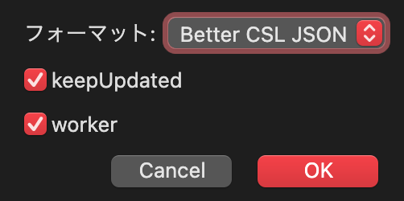

# Zotero Plugin 設定

## 必要なplugin

Better BibTex for Zotero (9.0.10, 執筆時点)

他に、下記pluginを入れているが、ここでは基本的に関係ない  
ZotMeta (1.1)  
ZotMoov (1.2.25)

## Better BibTex の設定

### Citation key の設定

環境設定 > Better BibTex > Citation key formula

Citation key 名がそのまま Obsidianにおける論文ノート名になるように設計しているので、
Obsidianで困らない名前をつけておくのが良い。  

### Obsidian用 文献情報のexportの設定

#### 前準備

Local環境にobsidianのフォルダ、配下のvaultのフォルダを作成しておく  
Obsidian/(vault-name)

その配下に  
Obsidian/(vault-name)/0_Zotero  
のようなフォルダを作成しておく

#### export fileの設定

Zotero > マイ・ライブラリ → 右クリック > ライブラリをエクスポート  
→ Better-CSL.json

Obsidian/(vault-name)/0_Zotero  
に配置

## 備考

ZoteroとBBTのバージョンが揃っていないと、うまくいかないことがある。  
2026年2月辺りは、Zoteroのバージョンアップ(7→8)と、それに対応するための各種pluginの頻繁な更新があったので注意。

