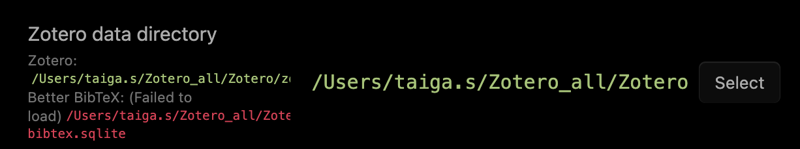

# Obsidian Plugin設定

## 導入するplugin

### Zotero関連

Zotero Integration  
Zotlit

### ObsidianのUI関係

Minimal Theme Settings  
Style Settings

### Obsidian運用における中核的plugin

Dataview  
Pandoc Plugin 

### 表作成・編集関係

Advanced Tables  
Markdown Table Editor  
Table Generator

## 各pluginの設定

細かい解説は省略。設定画面をAIに投げて聞けば良い。  
注意点のみ、下記に記載。

### Pandoc Plugin

ターミナル経由で何かインストール

```bash pandoc --version```

  
Zoteroのjsonファイルをまだここに置いていない場合は、[前段階のマニュアル](1_Zotero_plugin設定.md) を参照してexport  

### Simple Citations

Pandoc settings > Export folder のパス設定

### Zotlit

Zotero data directory  
画像のようなエラーが出ていても、問題なく動く。  



