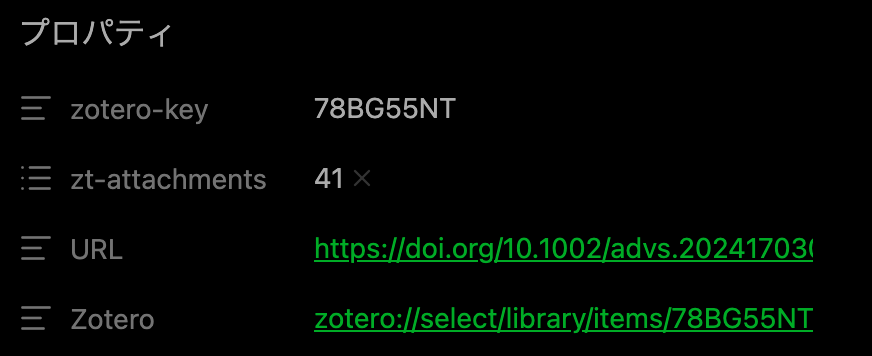

# Obsidian template設定

## 概説

論文ノートのページ(.mdファイル)を作成する際に、テンプレートを使用できる。
論文ページ(doi)やZoteroに接続できるようにするのは必須級。  
GAの表示と、Dataviewを使いやすくしておく事は次点で重要。  
ここでは、最低限の設定について説明する。使いやすいように、追加で最適化すると良い。  

## 設定対象ファイル

下記について、テキストエディタ上で編集する。  

### (Vaultname)/ZtTemplates/zt-field.eta.md

本ファイルは、論文mdファイル上部のフィールドを規定している。  

URL: "https://doi.org/<%= it.DOI %>"  
Zotero: "<%= it.backlink %>"  
を入れておく。

  
このリンクから、論文ページやZoteroの当該論文に飛べる。  
Zotero key, zotero attachment は消せない。

### (Vaultname)/ZtTemplates/zt-note.eta.md

本ファイルは、mdファイルの内容部分を規定している。  

#### GAの表示設定

ファイルには、下記を記載しておく。
![[<%= it.citationKey %>_GA.png]]  

ノート作成時は、下記のような表示になっており  
  

GA画像のファイル名を (citation key).pngにして、  
(vault-name)/0_attachment  
に画像を入れれば、GA画像が表示されるようにしている。  

画像形式がpngでない場合は、obsidian note側の拡張子を編集すれば良い。  
  
スクリーンショットを想定して、pngをデフォルト設定にしておき、違う場合のみ変更する運用が最適。

### Dataviewフィールドの設定

dataviewで表示や絞り込みに使うための情報を入れておくフィールド。  
多くの論文で使うフィールドのみ、テンプレートに記載しておく。一部の論文でしか使用しないものは、手動で書き込めば良い。

ファイルには、下記を記載しておく。  
Class:: Paper  
Year:: <%= new Date(it.date).getFullYear() %>  
Journal:: <%= it.publicationTitle %>  
Class は、dataview(後述)にて、paper/review/portalの区別に有用。

生成するmdファイルでは、下記のような表示になる。  

