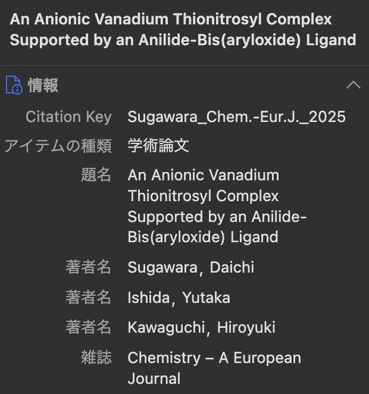
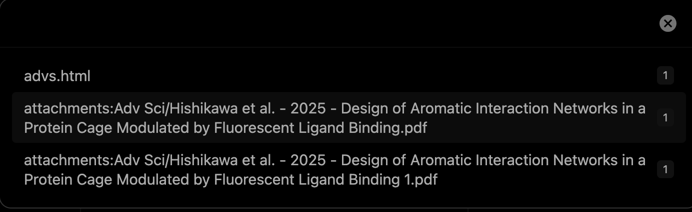

# Zotero + Obsidian システムの運用法 (論文ノート)

## 操作法

### 1. chrome

chormeのzotero拡張機能を利用して論文をzoteroに保存  

### 2. zotero

(確認のみ)  
設定が問題なければ、citation keyが設定されている。  
  
下記のObsidianでの工程用に、論文タイトルをコピーしておくとスムーズ。

### 3. Obsidian

command + P でコマンドパレットを開く  

Zotlit: refresh zotero data  
を押す。(BBTファイルの読み込み直し、最新版を参照する)

Zotlit: open quick switcher for literature note  
を押す。  
検索フィールドに論文名を入れるなどして、論文を選択する。citaion key では検索に引っかからない場合があるので注意。

  
mainのpdfと思われるものを選択  
→ テンプレートに従って論文ノートのmdファイルが生成する。

論文のメモや、dataview用のフィールド追加・入力値設定など、自由に行う。

