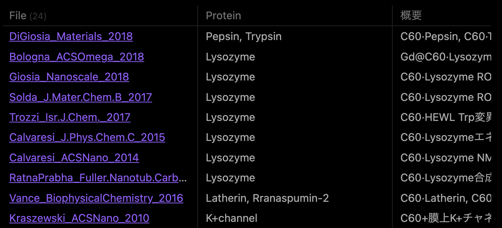

# Obsidian ポータルページの運用

## 概説

同種の論文ノートを階層的にまとめてリンクを示し、各ページへのアクセス性を向上させる役割を持つ。

例えば、タンパク質Xに関してのポータルであれば、  
・それを使用している論文一覧  
・Xが含まれるタンパク質ファミリーなどの、上位概念ポータル
・研究の方向性 (基礎研究か応用か)等の、下位概念ポータル
へのリンクを含ませる。

## 論文一覧の表示法

Dataview で、該当する論文一覧表を作成する。

表は、mdファイル内にdataviewのコマンドを記載することで自動的に作成できる。  
コマンドは、「'''dataview」と「'''」で囲う。  
基本的な考え方としては、検索範囲を全論文に指定して、そこから絞り込んでいく形。

まずは、下記の文法で、表で何の項目(列)記載するか指定する。  
Table A, B, C, ...
ここでのA, B, Cは、論文ノートのmdファイルに記載しているプロパティ名(A:: の形) 
(説明は [5_運用法_論文ノート](docs/5_運用法_論文ノート.md) を参照)  
プロパティ名が長ければ、 C as D の形にして表示名を変更できる。

範囲指定と最低限の絞り込み (共通):  
from ""  
where Class = "Paper"  
where !contains(file.path, ".eta")  
Paper は Review に切り替えても良い。  
このコマンドの下の行に、下記の絞り込みを書いていく。

絞り込みに頻用するコマンド(個別):

where contains(A, "B")  
→ フィールドA:: に値Bを含むもの

where A  
→ フィールドA:: に何かしらの値があるもの 

sort year desc  
→ 出版年が降順になるように並び替え。昇順なら、「sort year」だけで良い。

結果として、下記のような表示になる。

概要:: というプロパティフィールドを用意して、論文を自分なりに一言で要約しておくと便利。

### 他ポータルへのリンク

記載法については、以降のステップ  
[7_運用法_グラフビュー](docs/7_運用法_グラフビュー.md)  
を参照。

