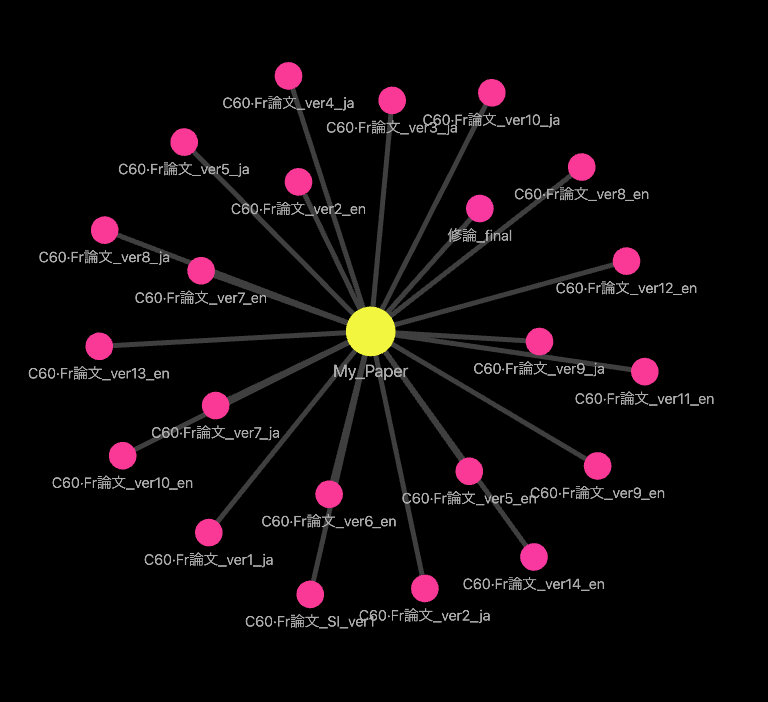
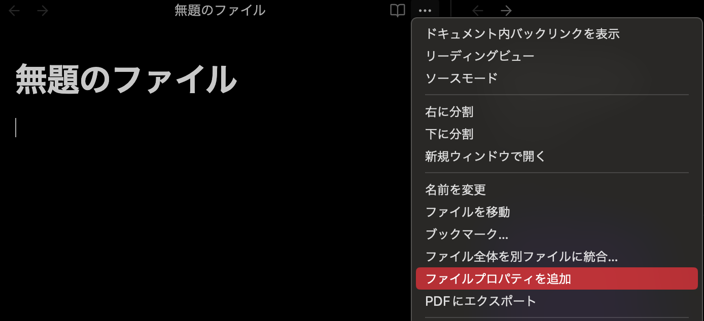
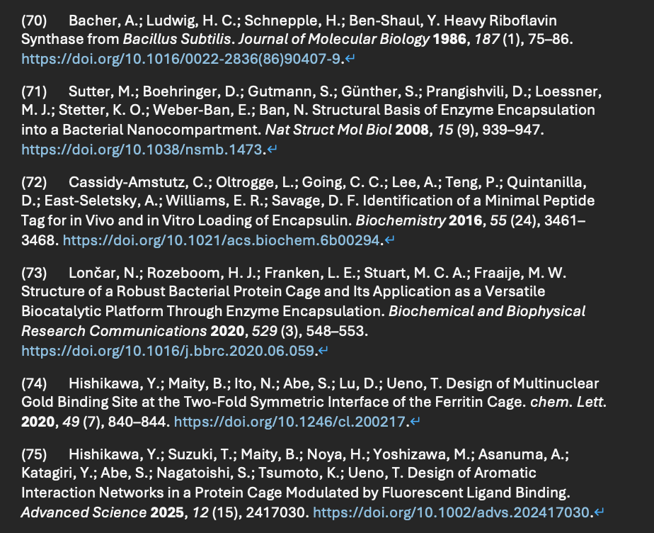

# Obsidian運用法 論文作成

## 概説

Obsidian上(軽快な動作環境)で論文を執筆し、文中の引用表示・参考文献リスト付きのword文書を出力することが可能である。

## 手順

### 執筆論文mdファイル・ポータル の作成

Finder上で、執筆論文用のフォルダを作成しておく。  
執筆論文mdファイルはその中に入れておく。執筆バージョン更新の際は、mdファイルを同フォルダ内で複製し、別の名前を付ければ良い。

執筆論文ページでグラフビューを汚さない (遊離点を作らない) ことや、バージョン管理を考慮して、ポータルページを作成しておく。  
ポータルページから、執筆論文ページへのリンクを作成しておく。  

執筆論文ページでは、論文ページへの通常リンクは基本的に作成しない運用になる。  
グラフビューでは、ポータルを中心とした浮島ができる形。  

執筆論文の各バージョンには、ポータルページからアクセスするため、グラフビュー経由でアクセスすることはまず無い。  
したがって、グラフビューにおいてポータルから多数の執筆ページに対してリンクが伸びる状態になっても問題ないが、
気になるなら、旧バージョンをvault外に出してアーカイブする、oldフォルダを作成して、表示除外設定を行う等の対応は可能。

### 執筆論文mdファイル の中身の作成

#### プロパティ欄

ページ右上の「...」をクリックし、ファイルプロパティ欄を作成する。

プロパティ名を「csl」に変更する。  
[各種論文引用スタイルのcslを配布しているサイト](https://github.com/citation-style-language/styles)から、
投稿想定誌に対応するcslをダウンロードする。  
当該サイトでは非常に多数のcslを配布しており、全体から目で見て探すことは困難である。  
AIに聞いて、検索すると良い。

ダウンロードしたcslをvault内のフォルダに設置し、cslの相対pathをプロパティ欄に記載する。

#### 論文本文

文中の引用箇所に [@citekey] の形で記述する。(@の付け忘れに注意)  
複数の場合は、[@citekey; @citekey; @citekey] のように、"; "で区切る。  
[]内の順番を気にする必要はない。同論文を複数箇所で引用しても問題ない。

[@citekey] は緑色で表示されるが、これはリンクではないので、ページ遷移機能はない。  
同様に、グラフビューにも反映されないので、グラフビューを汚す心配もない。

### wordファイルの出力

command + P でコマンドパレットを出す。  
Pandoc plugin: Export as word document を押す。

Obsidianウインドウの右上に、出力中の旨と、出力の成否に関するのメッセージが出てくる。  
出力は数秒で終わる。  
このメッセージは数秒で消えてしまうので、少し待って確認するのが良い。  

出力されたwordファイルでは、スタイル(csl)にしたがって引用表示(上付き文字)や参考文献セクションがついている。

## 備考・注意点

本方法は、文章編集環境の軽快さや引用の管理が楽になる点では有利であるが、wordのような変更点の表示・追跡はできない。  
(この辺りを解決するpluginがあるかもしれないが、今の所調べていない。)

下記のような執筆体制であれば問題ないと思われる。  
・ほぼ自力で執筆し、共著者はコメントする程度  
・共著者もobsidian、またはその他のmdファイルエディタを使用

しかし、共著者がwordのみを使用し、編集追跡機能を使用する体制の場合、照合やコピペの手間は発生する。  
(但し、このデメリットを差し引いても、この執筆体制は効率的である。)

